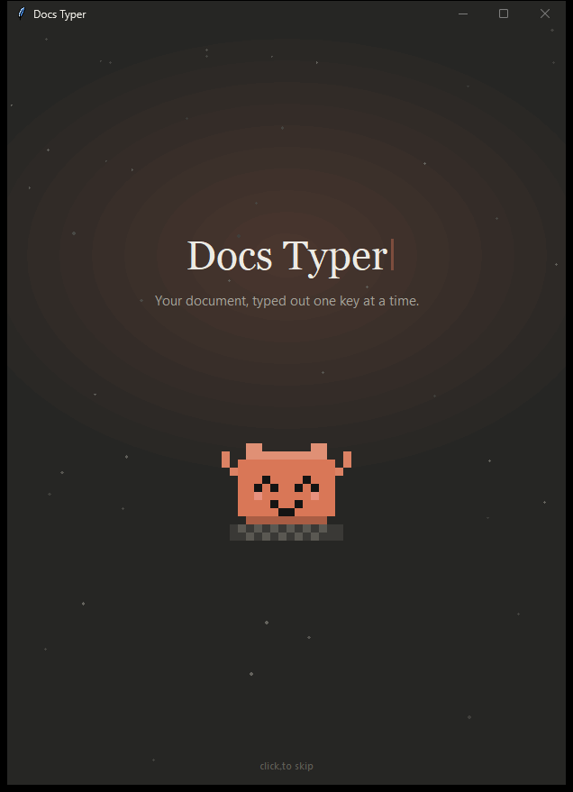
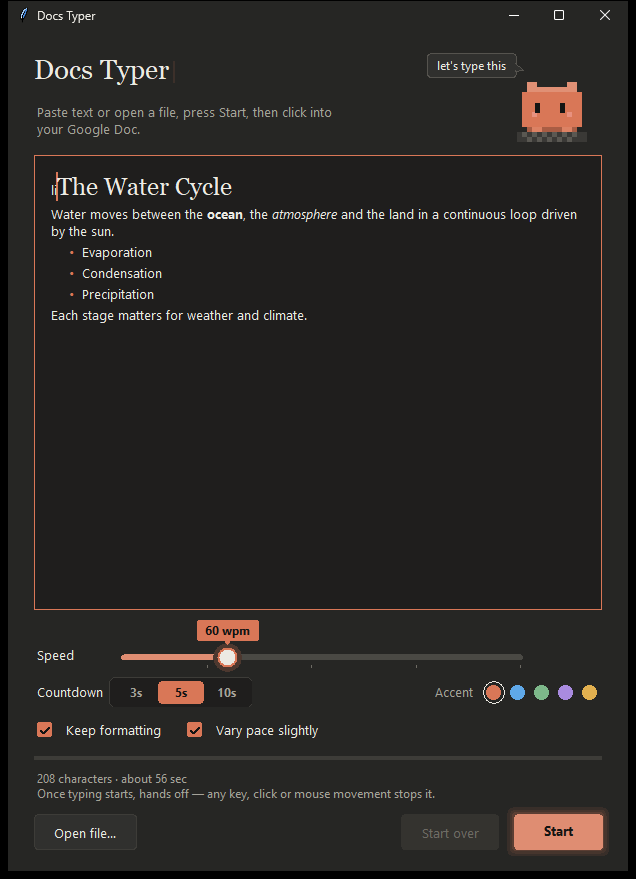
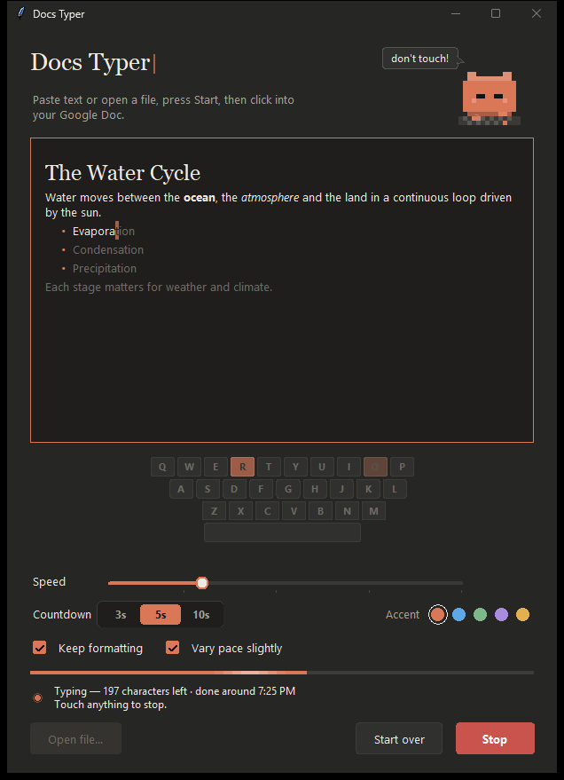

# Docs Typer

Types a document into Google Docs one keystroke at a time, keeping its formatting. It works on
**Windows** and **macOS**.

<p align="center">
  
  
  
</p>

## Install

**1. Download it.** Click **[Download ZIP](https://github.com/4d1t-Codezz/docs-typer/archive/refs/heads/main.zip)**
(or the green **Code** button → **Download ZIP**), then open the ZIP to unzip it.

**2. Run the installer** in the unzipped folder:

| On a Mac | On Windows |
| --- | --- |
| Double-click **`Install on Mac.command`** | Double-click **`Install on Windows.bat`** |
| It puts **Docs Typer** in your Applications folder and opens it. If you don't have a suitable Python, it offers to install one for you. | It adds **Docs Typer** to your desktop and Start menu and opens it. If you don't have Python, it opens the download page. On the installer's first screen, tick **Add python.exe to PATH**, then run `Install on Windows.bat` again. |

**3. Mac only: allow permissions.** The first time you press **Start**, macOS asks for
**Accessibility** (so it can type) and **Input Monitoring** (so it can stop when you touch
anything). Turn both on for Docs Typer in **System Settings → Privacy & Security**, then quit and
reopen Docs Typer.

> **Turned it on but it still asks?** Each install counts as a new app to macOS, so an old entry
> won't match. In both lists, select **Docs Typer**, click **−** to remove it, then press **Start**
> again and allow it fresh. Old **python3** entries from an earlier version can be removed too.

> **Mac says the installer "can't be opened" or "Apple could not verify" it?** Click **Done**, then
> go to **System Settings → Privacy & Security**, scroll down and click **Open Anyway** next to
> `Install on Mac.command`.
>
> **Windows shows "Windows protected your PC"?** Click **More info → Run anyway**.

On Windows, keep the unzipped folder where it is, because the shortcuts run Docs Typer from there. To
update, download the new ZIP and run the installer again.

## Use it

1. **Add your text.** Paste it into the box (Ctrl/⌘+V), or click **Open file…** to load a `.docx`,
   `.rtf`, `.odt`, `.html` or `.txt` file.
2. **Press Start** (or Ctrl/⌘+Enter).
3. **Click into your Google Doc** where the text should go, before the countdown ends.
4. **Hands off.** Don't touch the keyboard or mouse while it types. If you do, it stops. To keep
   going, put your cursor back where it left off and press **Resume**.

Tips:
- Google Docs turns lines starting with `- ` or `1. ` into lists automatically. You can turn that
  off under **Tools → Preferences → Automatically detect lists**.
- To paste text into the box without its formatting, use Ctrl/⌘+Shift+V.

## Features

- **Opens** `.docx`, `.rtf`, `.odt`, `.html` and `.txt` files. You can also paste rich text straight
  from Google Docs or Word.
- **Keeps formatting:** bold, italic, underline, strikethrough, superscript and subscript,
  headings 1–6, bullet and numbered lists with nesting, and alignment. These are recreated with
  Google Docs' own keyboard shortcuts (Ctrl-based on Windows, ⌘-based on Mac).
- **Speed from 10 to 200 wpm**, with an optional *vary pace* mode that adds natural pauses.
- **Hands-off safety:** any real key, click, scroll or mouse movement stops typing, and so does
  switching to another app.
- **Live view:** the text in the window lights up as it's typed, a key strip shows each key, and
  the status shows live speed and an estimated finish time.
- **Tappy**, a pixel critter who types along, follows your mouse with its eyes, reacts when you
  stop it and celebrates when it's done.
- A choice of 3, 5 or 10 second countdown, five accent colors, and remembered settings.

## For developers

Run it straight from the repo with `python -m docstyper` (Python 3.10+ with Tk 8.6+). The
installers call the helper scripts in `scripts/`. `build-mac-app.sh` builds `dist/Docs Typer.app`, and
`make-windows-shortcuts.ps1` creates the Windows shortcuts.

### How it works

```
docstyper/
  readers.py      .docx / .odt / .html / .rtf / .txt  →  paragraphs with formatting
  keystrokes.py   paragraphs → a platform-neutral plan of keystrokes and named actions
                  ("bold", "heading2", "bullet", ...), plus the Typer that plays it
  platforms/
    windows.py    SendInput, low-level keyboard/mouse hooks, Win32 clipboard
    macos.py      Quartz CGEventPost, a listen-only CGEventTap, NSPasteboard (via ctypes)
  ui.py           the window; widgets.py, mascot.py, intro.py and motion.py do the animation
```

Each backend maps the named actions to that platform's Google Docs shortcuts. The keystrokes it
sends are tagged, so the input watcher can ignore them and only react to you.

### Tests

```
python -m unittest discover -s tests -t . -v
```

The tests cover the file readers, the keystroke plan, the typing loop (with a fake backend), and
each platform's shortcut table. They also include a UI smoke test that plays the intro and every
animation without sending any input. GitHub Actions runs them on Windows and macOS.
